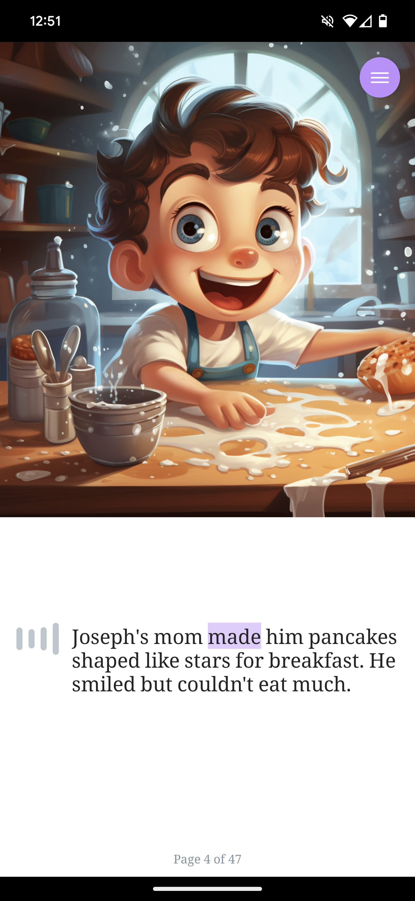

*Stay tuned to our blog and social media channels for updates, tips, and stories from our community. Let’s make storytelling a magical experience for every child!*

**[Install StoryCraft on Android](https://play.google.com/store/apps/details?id=com.storycraftv2)**

## Introduction
Greetings to our StoryCraft community! Today marks an exciting milestone for us, as we proudly announce the launch of our latest campaign, "Imagination Unleashed: The Power of Personalized Storytelling." This campaign is not just a new chapter in our journey but a celebration of creativity, learning, and the endless possibilities of storytelling.

## The Essence of Our Campaign
At the heart of our campaign is the belief that every child deserves a story that resonates with them. "Imagination Unleashed" is all about bringing personalized, engaging, and educational stories to the forefront of childhood learning and development. Our cutting-edge AI technology, combined with a touch of human creativity, ensures that every story is tailored to the child's age, name, and chosen themes.

## What's New in StoryCraft

* **Personalized Story Text**: The core of StoryCraft, our generative AI, now comes with enhanced capabilities, crafting stories that are not just age-appropriate but also resonate with the personal interests of each child.
* **Audio Storytelling**: We're introducing a new feature – audio versions of our stories. Now, children can listen to their personalized tales, making story-time easy and accessible, anytime and anywhere.
* **Imagery That Speaks Volumes**: Alongside our textual and auditory storytelling, the campaign also emphasizes the automatic matching of imagery to story text, creating a rich and immersive visual experience for young readers.

## Why This Matters
We believe in the power of stories to shape minds, instill values, and spark imagination. With "Imagination Unleashed," we aim to foster a love for reading and storytelling among children, making learning a delightful and interactive experience. It's not just about reading; it's about experiencing, imagining, and growing.

## Join Us On This Adventure
We invite you, our beloved community of parents, educators, and storytellers, to join us on this exciting journey. Whether it's through trying out the app, participating in our community events, or simply sharing the word – your support means the world to us.

## Conclusion
As we launch "Imagination Unleashed," we're filled with hope and excitement for what the future holds. We believe that every child’s story is unique and worth telling. Thank you for being a part of this journey, and let's continue to craft stories that inspire, educate, and entertain.
